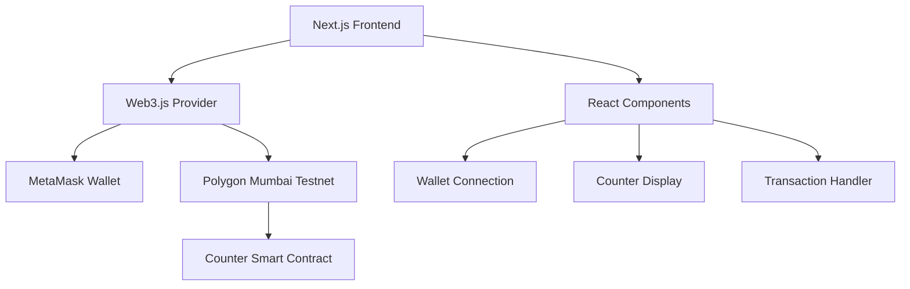

# Design Document

## Overview

The Web3 Counter Application is a decentralized application (dApp) built with Next.js that demonstrates basic blockchain interaction patterns. The application consists of a smart contract deployed on Polygon Mumbai testnet that stores a counter value, and a React-based frontend that allows users to connect their wallet and interact with the counter through Web3.js.

## Architecture

### High-Level Architecture



### Technology Stack

- **Frontend Framework**: Next.js 14 with React 18
- **Blockchain Library**: Web3.js v4
- **Wallet Integration**: MetaMask browser extension
- **Blockchain Network**: Polygon Mumbai Testnet
- **Smart Contract Language**: Solidity
- **Styling**: Tailwind CSS for responsive design
- **State Management**: React hooks (useState, useEffect)

## Components and Interfaces

### Frontend Components

#### 1. App Component (`pages/index.js`)
- Main application container
- Manages global application state
- Handles wallet connection status
- Coordinates between child components

#### 2. WalletConnection Component
- Handles MetaMask connection logic
- Displays wallet address when connected
- Shows connection status and errors
- Provides network switching functionality

#### 3. CounterDisplay Component
- Fetches and displays current counter value
- Shows loading states during blockchain reads
- Handles read operation errors
- Auto-refreshes after successful transactions

#### 4. CounterControls Component
- Provides increment button
- Handles transaction initiation
- Shows transaction status (pending/confirmed/failed)
- Displays transaction hashes and links to explorer

#### 5. TransactionStatus Component
- Shows current transaction state
- Displays transaction hash
- Provides link to Polygonscan
- Shows gas fee estimates

### Smart Contract Interface

#### Counter Contract
```solidity
contract Counter {
    uint256 public count;
    
    event CounterIncremented(uint256 newCount, address incrementedBy);
    
    function increment() public {
        count += 1;
        emit CounterIncremented(count, msg.sender);
    }
    
    function getCount() public view returns (uint256) {
        return count;
    }
}
```

### Web3 Integration Layer

#### Web3Provider Service
- Initializes Web3.js with Polygon Mumbai RPC
- Manages wallet connection state
- Handles network switching
- Provides contract interaction methods

#### Contract Service
- Abstracts smart contract interactions
- Handles contract method calls (read/write)
- Manages transaction lifecycle
- Processes contract events

## Data Models

### Application State
```typescript
interface AppState {
  isWalletConnected: boolean;
  walletAddress: string | null;
  currentNetwork: string | null;
  counterValue: number;
  isLoading: boolean;
  error: string | null;
}
```

### Transaction State
```typescript
interface TransactionState {
  hash: string | null;
  status: 'idle' | 'pending' | 'confirmed' | 'failed';
  error: string | null;
  gasUsed: string | null;
}
```

### Network Configuration
```typescript
interface NetworkConfig {
  chainId: string;
  chainName: string;
  rpcUrls: string[];
  blockExplorerUrls: string[];
  nativeCurrency: {
    name: string;
    symbol: string;
    decimals: number;
  };
}
```

## Error Handling

### Wallet Connection Errors
- MetaMask not installed: Display installation instructions
- User rejection: Show user-friendly message to retry
- Network mismatch: Prompt automatic network switching
- Connection timeout: Provide retry mechanism

### Transaction Errors
- Insufficient funds: Clear error message with funding instructions
- Gas estimation failure: Suggest manual gas limit
- Transaction rejection: Allow user to retry
- Network congestion: Display estimated wait times

### Contract Interaction Errors
- Contract not found: Verify deployment and network
- Method call failure: Display specific error from blockchain
- Read operation timeout: Implement retry logic
- Invalid contract address: Configuration validation

## Testing Strategy

### Unit Testing
- Component rendering and state management
- Web3 service methods and error handling
- Contract interaction utilities
- Network switching logic

### Integration Testing
- Wallet connection flow end-to-end
- Counter increment transaction flow
- Error handling scenarios
- Network switching functionality

### Smart Contract Testing
- Counter increment functionality
- Event emission verification
- Access control (if implemented)
- Gas optimization validation

### Manual Testing Checklist
- MetaMask connection on different browsers
- Transaction flow with various gas prices
- Network switching between testnets
- Mobile responsiveness
- Error state handling

## Security Considerations

### Frontend Security
- Input validation for all user interactions
- Secure handling of wallet addresses
- Protection against XSS attacks
- Safe contract address configuration

### Smart Contract Security
- Simple counter logic minimizes attack surface
- No external dependencies or complex logic
- Event logging for transparency
- Gas optimization to prevent DoS

### Web3 Integration Security
- Validate all blockchain responses
- Handle wallet disconnection gracefully
- Secure RPC endpoint configuration
- Transaction replay protection

## Performance Considerations

### Frontend Optimization
- Lazy loading of Web3 components
- Efficient re-rendering with React.memo
- Debounced blockchain calls
- Optimistic UI updates where appropriate

### Blockchain Interaction
- Batch multiple read operations
- Cache counter value with smart invalidation
- Efficient gas estimation
- Connection pooling for RPC calls

## Deployment Configuration

### Environment Variables
```
NEXT_PUBLIC_CONTRACT_ADDRESS=0x...
NEXT_PUBLIC_POLYGON_RPC_URL=https://rpc-mumbai.maticvigil.com
NEXT_PUBLIC_CHAIN_ID=80001
```

### Build Configuration
- Next.js production build optimization
- Static asset optimization
- Bundle size analysis and optimization
- Environment-specific configurations